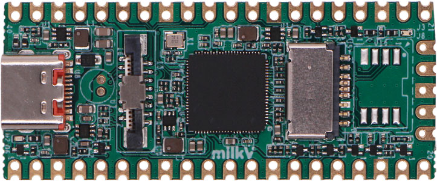

.. |yes| image:: ../../images/yes.png
.. |no| image:: ../../images/no.png

.. role:: underline
   :class: underline

Milk-V Duo256m
==========

+----------------+-----------------+
| System on Chip | Sophgo SG2002   |
+----------------+-----------------+
| Number GPIO    | 26              |
+----------------+-----------------+
| Status         | Fully supported |
+----------------+-----------------+

Supported Features
------------------

+----------------+-----------------+
| Read / Write   | |yes|           |
+----------------+-----------------+
| Interrupt      | |yes|           |
+----------------+-----------------+

GPIO Mapping
------------

+----+----+-----+------+------+-----+-----+-----+----+----+-----+----+-----+----+----+----+----+-----+----+----+
| 5V | 5V | GND | 3.3V | 3.3V | N/A | N/A | GND | 27 | 26 | RUN | 22 | GND | 21 | 20 | 19 | 18 | GND | 17 | 16 |
+----+----+-----+------+------+-----+-----+-----+----+----+-----+----+-----+----+----+----+----+-----+----+----+
| 0  | 1  | GND | 2    | 3    | 4   | 5   | GND | 6  | 7  | 8   | 9  | GND | 10 | 11 | 12 | 13 | GND | 14 | 15 |
+----+----+-----+------+------+-----+-----+-----+----+----+-----+----+-----+----+----+----+----+-----+----+----+

Additional
----------

- Blue LED: 25

Note: GPIO 25 is the system status indicator LED of Duo256M.
Before using wiringX to control this LED, its blinking function needs to be disabled in the system.
Otherwise, the control will not take effect and no error message will be returned.
