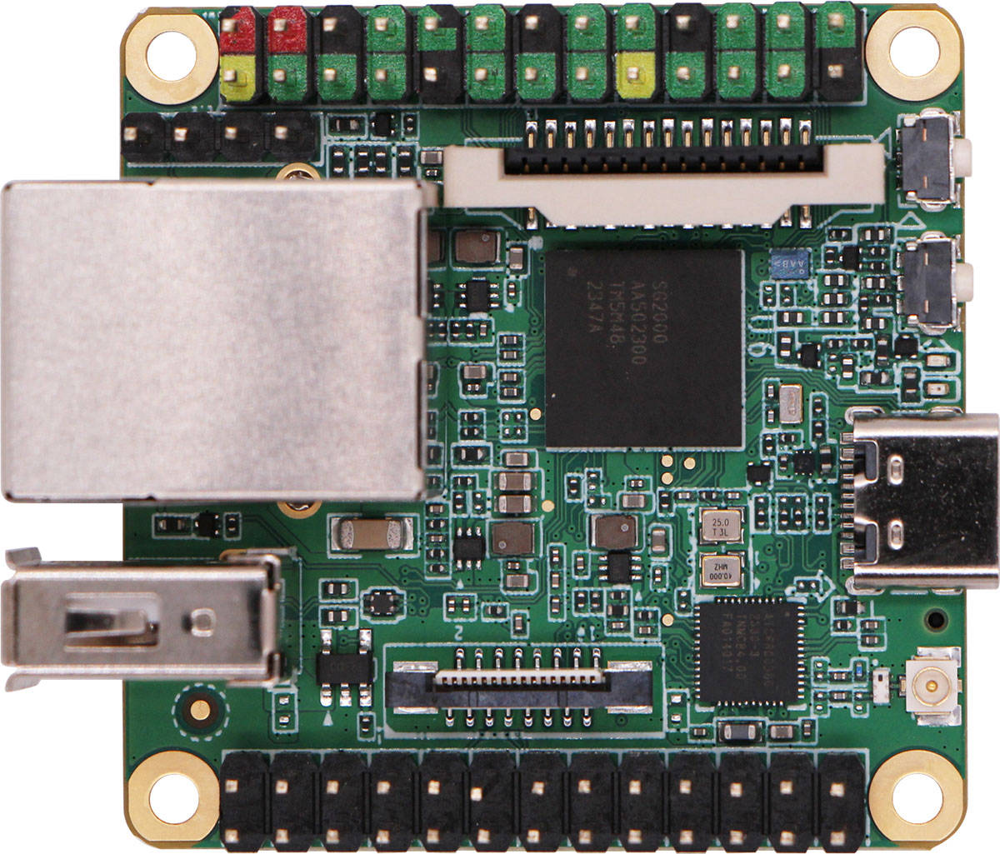

.. |yes| image:: ../../images/yes.png
.. |no| image:: ../../images/no.png

.. role:: underline
   :class: underline

Milk-V Duos
==========

+----------------+-----------------+
| System on Chip | Sophgo SG2002   |
+----------------+-----------------+
| Number GPIO    |    39           |
+----------------+-----------------+
| Status         | Fully supported |
+----------------+-----------------+

Supported Features
------------------

+----------------+-----------------+
| Read / Write   | |yes|           |
+----------------+-----------------+
| Interrupt      | |yes|           |
+----------------+-----------------+

GPIO Mapping
------------

J3:
+----+----+-----+----+----+----+----+-----+----+----+----+----+-----+
|5.0V|5.0V| GND | 8  | 10 | 12 |GND | 16  | 18 | GND| 22 | 24 | 26  | 
+----+----+-----+----+----+----+----+-----+----+----+----+----+-----+
|3.3v| 3  |  5  | 7  |GND | 11 | 13 |  15 |3.3v| 19 | 21 | 23 | GND | 
+----+----+-----+----+----+----+----+-----+----+----+----+----+-----+

J4:
+----+----+-----+----+----+----+----+-----+----+----+----+----+-----+
| -1 | -1 | -1  | -1  |3.3V| 41 | 39 | GND | 35 | 33 | GND| 29 | 27  | 
+----+----+-----+----+----+----+----+-----+----+----+----+----+-----+
|5.0v| 50 |  48 | 46 | 44 | 42 | 40 | GND | 36 | 34 | GND| 30 | 28  | 
+----+----+-----+----+----+----+----+-----+----+----+----+----+-----+

Note: GPIO 0 is connected to the User LED.
